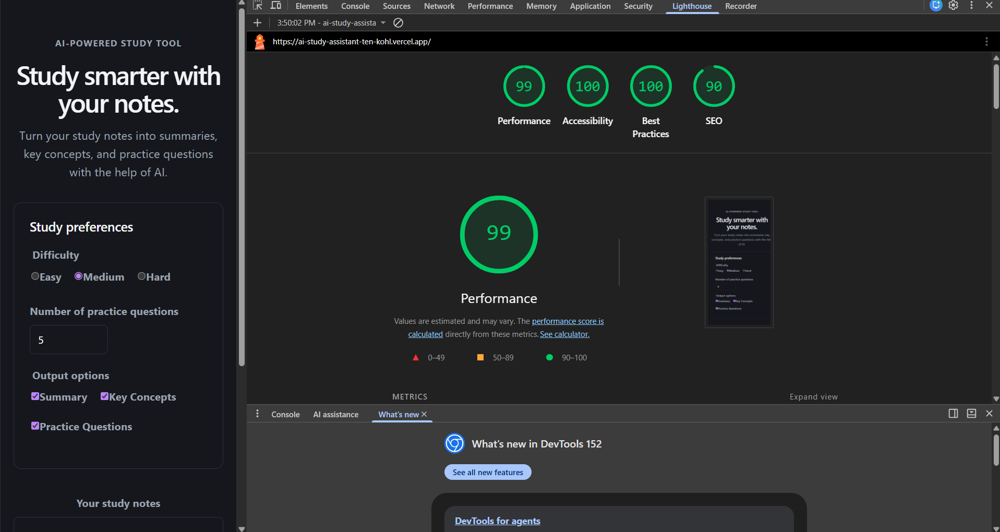
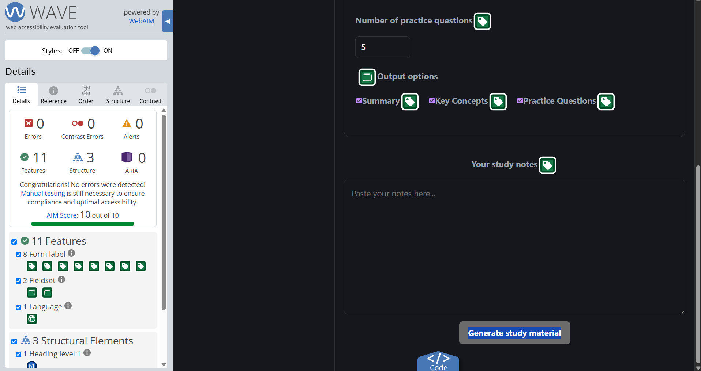

# AI Study Assistant — Accessibility & Performance Audit

## Overview

This document records the accessibility and performance audit conducted on the deployed AI Study Assistant.

The application was evaluated using:

- Lighthouse with the Mobile preset
- WAVE Web Accessibility Evaluation Tool
- Keyboard-only navigation
- Vitest and React Testing Library
- Production build verification

The goal was to maintain Lighthouse Performance and Accessibility scores above 90, achieve zero WAVE errors, ensure the complete primary flow works using only a keyboard, and improve accessibility for AI-generated content.

---

## 1. Lighthouse Mobile Audit

Lighthouse was run against the deployed production application using the Mobile preset.

### Before Accessibility Improvements

| Category | Score |
| --- | ---: |
| Performance | 98 |
| Accessibility | 100 |
| Best Practices | 100 |
| SEO | 90 |

### After Accessibility Improvements

| Category | Score |
| --- | ---: |
| Performance | 99 |
| Accessibility | 100 |
| Best Practices | 100 |
| SEO | 90 |

### Before vs After

| Category | Before | After | Change |
| --- | ---: | ---: | ---: |
| Performance | 98 | 99 | +1 |
| Accessibility | 100 | 100 | Maintained |
| Best Practices | 100 | 100 | Maintained |
| SEO | 90 | 90 | Maintained |

Performance improved from **98 to 99**, while the perfect **100 Accessibility score** was maintained.

Both Performance and Accessibility remain above the assignment target of 90.

---

## 2. WAVE Accessibility Audit

The deployed application was evaluated using WAVE before and after the accessibility changes.

### Final WAVE Results

| Check | Result |
| --- | ---: |
| Errors | 0 |
| Contrast Errors | 0 |
| Alerts | 0 |
| AIM Score | 10/10 |

WAVE detected **zero accessibility errors, zero contrast errors, and zero alerts** on the audited page.

---

## 3. Keyboard-Only Accessibility Test

The application's primary workflow was manually tested without using a mouse.

The following interactions were verified:

- Difficulty options can be reached and selected using the keyboard.
- Number of practice questions can be reached and edited.
- Output-option checkboxes can be reached and toggled.
- The study-notes textarea can be reached and edited.
- Generate Study Material can be activated using the keyboard.
- Stop Generating is keyboard reachable during an active AI request.
- Generation can be cancelled without pointer input.
- Generated study material receives keyboard focus after successful generation.
- Keyboard focus remains visually identifiable while navigating the interface.

### Issue Found

During the initial keyboard-only test, the newly generated study material was not effectively reachable or identified after generation.

### Fix

Focus management was added to the generated result section using a React ref and effect.

After the AI response is generated, keyboard focus is moved to the Study Material region so that keyboard users can immediately access the new content.

---

## 4. AI-Specific Accessibility

### Polite Live Region

AI-generated output uses:

`aria-live="polite"`

This allows assistive technologies to announce newly generated content without unnecessarily interrupting the user.

A screen-reader status message is also provided while the application is generating study material.

### Accessible Generated Content

The generated Study Material region is labelled using its heading and made keyboard accessible.

Focus management ensures that users are directed to newly generated content when the AI response finishes.

### Stop Generating Control

A keyboard-accessible **Stop generating** button was added while generation is in progress.

The application uses `AbortController` to cancel the active API request when the user activates this control.

This allows AI generation to be interrupted using only the keyboard.

---

## 5. Automated Testing

The application tests were checked after implementing the accessibility improvements.

The final App test suite result was:

- **4 tests passed**
- **0 tests failed**

The tests verify:

- Empty-notes validation
- Preference validation
- Loading state
- API request preferences
- Accessibility of the loading controls

The loading-state test was updated to distinguish between the disabled **Generating...** button and the enabled **Stop generating** button.

---

## 6. Production Build Verification

A production build was run using:

`npm run build`

The build completed successfully.

### Build Result

- 176 modules transformed
- JavaScript bundle: approximately 311.88 kB
- JavaScript gzip size: approximately 96.52 kB
- CSS bundle: approximately 4.12 kB
- CSS gzip size: approximately 1.49 kB
- No production build errors

---

## 7. Accessibility & Performance Changes

The following improvements and checks were completed:

- Added keyboard access to generated AI study material.
- Added focus management for newly generated content.
- Verified `aria-live="polite"` for AI-generated output.
- Maintained a screen-reader loading announcement.
- Added a keyboard-reachable Stop Generating button.
- Added AbortController-based request cancellation.
- Added accessible labelling for the generated result region.
- Verified semantic labels for form controls.
- Verified keyboard operation of radio buttons and checkboxes.
- Verified visible keyboard focus.
- Verified color contrast with WAVE.
- Re-ran Lighthouse after implementation.
- Re-ran WAVE after implementation.
- Updated automated tests for the new AI controls.

---

## 8. Final Results

| Evaluation Requirement | Final Result |
| --- | --- |
| Lighthouse Mobile Performance 90+ | PASS — 99 |
| Lighthouse Accessibility 90+ | PASS — 100 |
| WAVE Errors | PASS — 0 |
| WAVE Contrast Errors | PASS — 0 |
| WAVE Alerts | PASS — 0 |
| Keyboard-only primary flow | PASS |
| AI output announced politely | PASS |
| Keyboard-reachable Stop button | PASS |
| Automated App tests | PASS — 4/4 |
| Production build | PASS |

## Conclusion

The AI Study Assistant meets the performance and accessibility requirements of the assignment.

The final deployed application achieved **99 Performance** and **100 Accessibility** in the Lighthouse Mobile audit, while WAVE reported **zero errors, zero contrast errors, and zero alerts**.

The complete primary workflow is keyboard accessible, and AI-specific accessibility has been improved through polite live announcements, generated-content focus management, and a keyboard-accessible Stop Generating control.